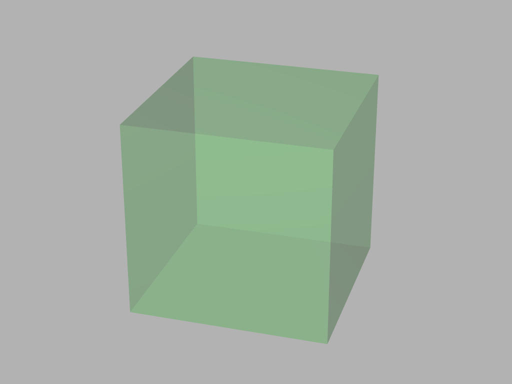
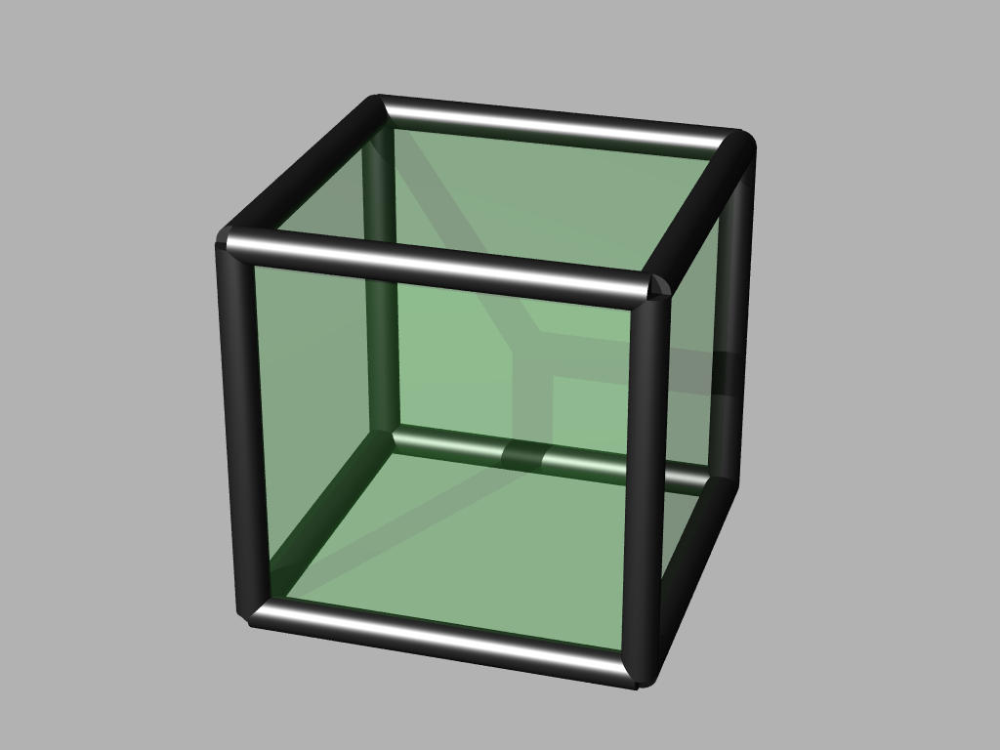
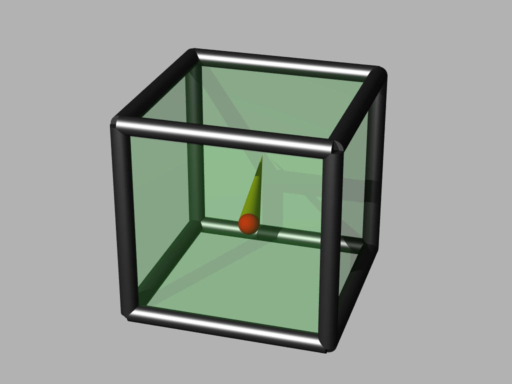
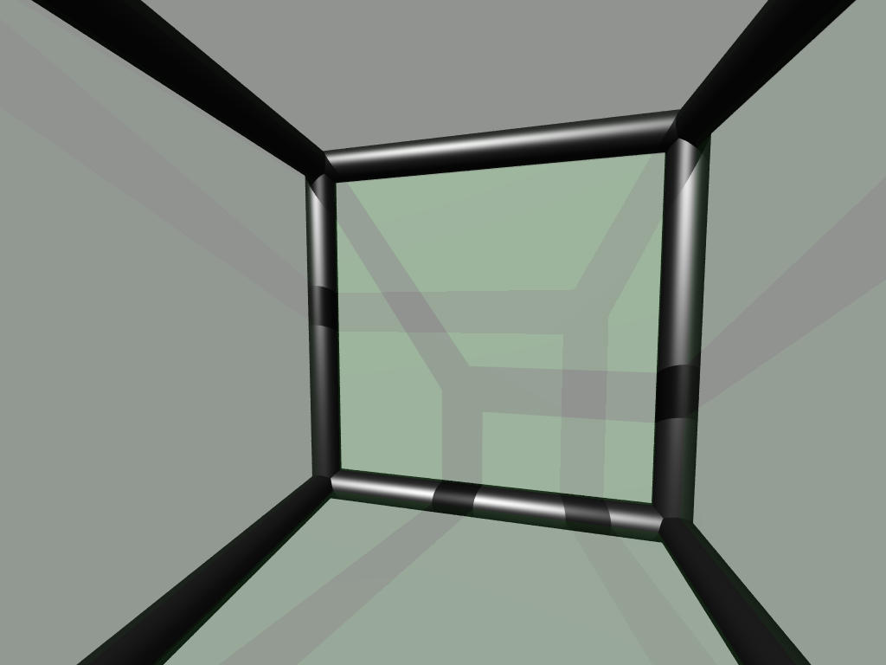
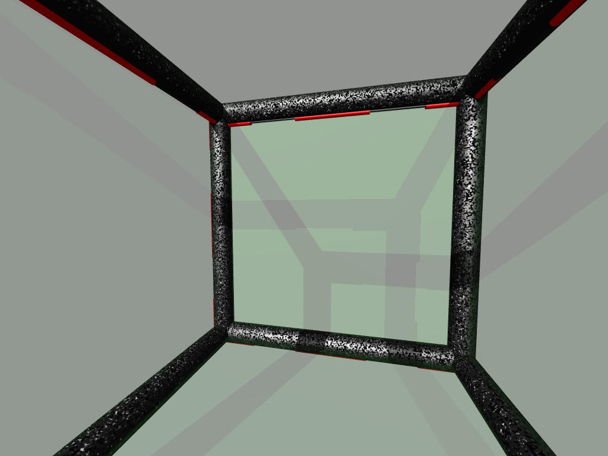
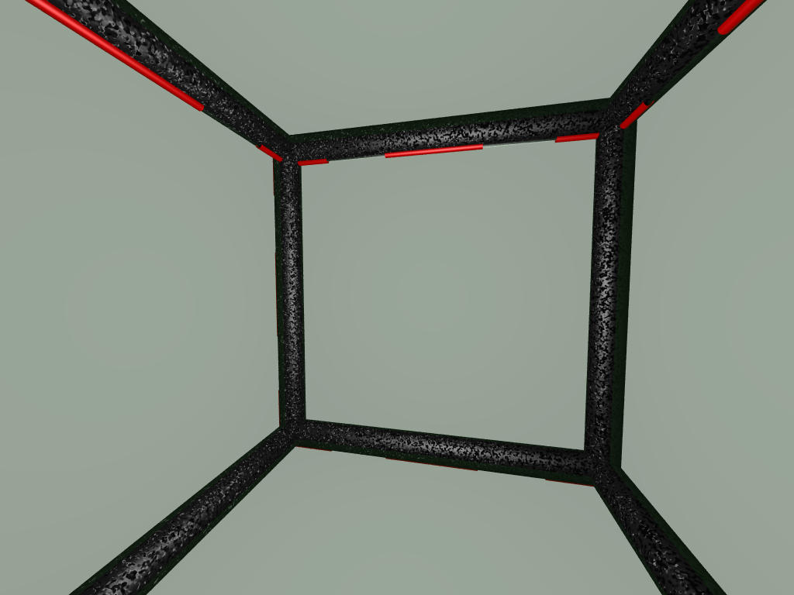
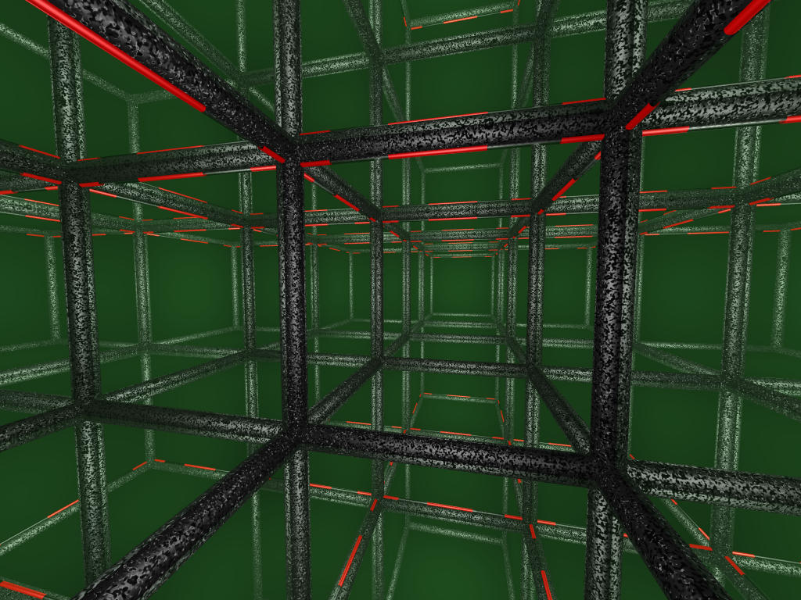
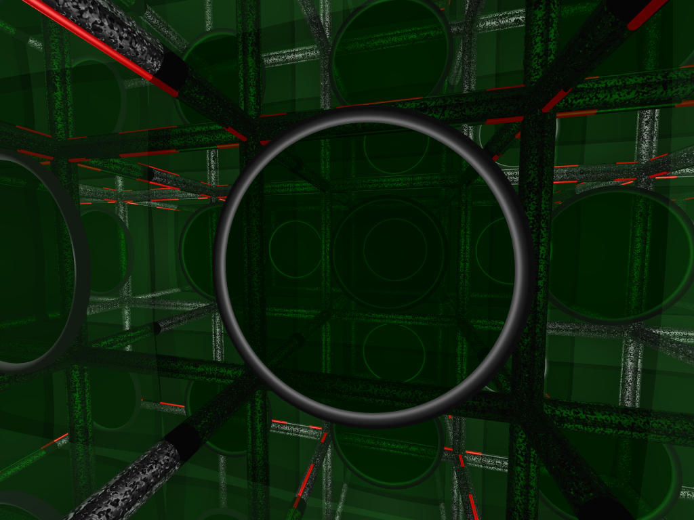
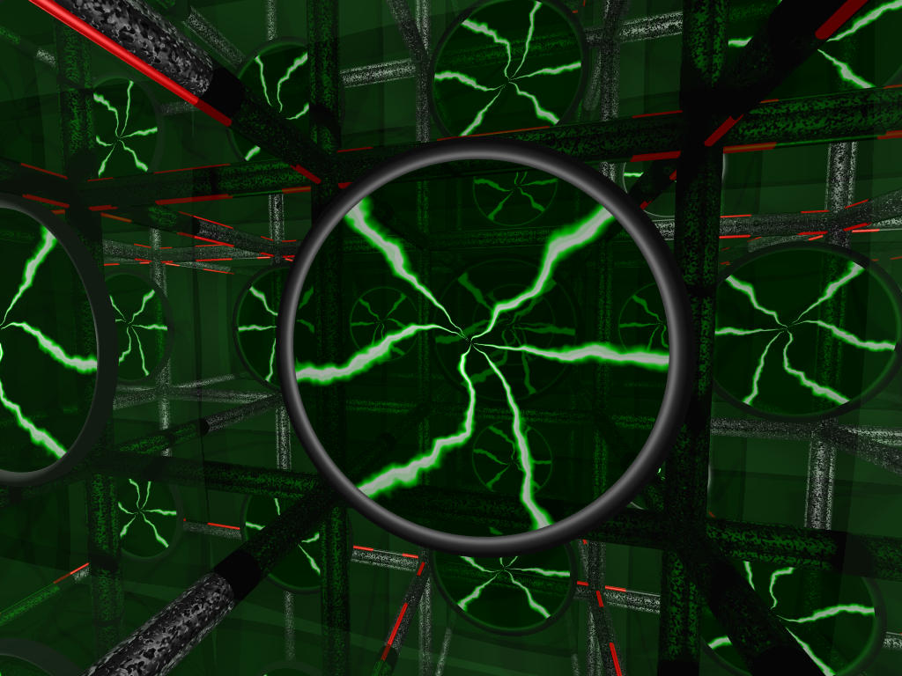
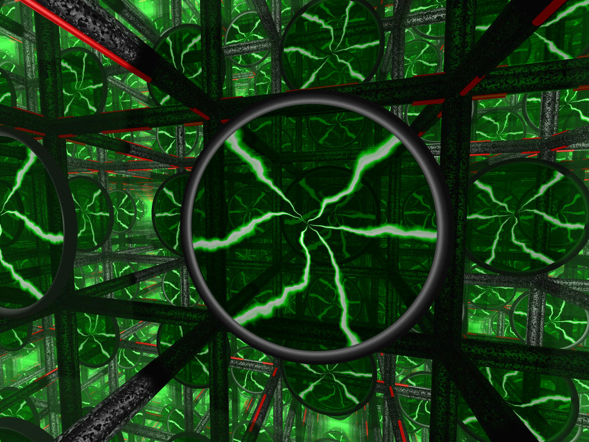

# Making of borg cube (POV-Ray)
A not so detailed description of the scene file

## 001 - it starts with a box

## 002 - add edges

## 003 - show camera location and direction

## 004 - view from inside camera

## 005 - make egdes more interesting

## 006 - move light source inside

## 007 - add reflection to box

## 008 - add transparent disc

## 009 - add lightning texture to disc

## 010 - raise max trace level to 25

